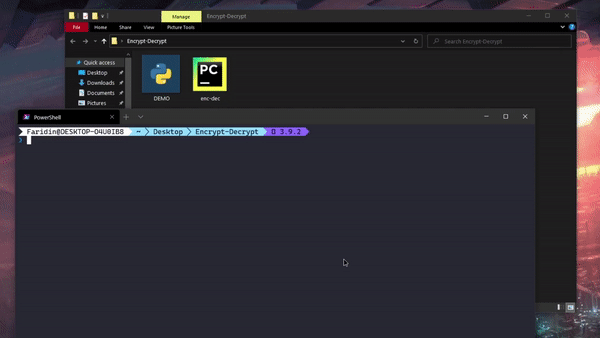

# enc-dec
Python CLI tool for Encrypting and Decrypting file.

<p align="center">

</p>

## Usage
```console
$ python .\enc-dec.py --help
  usage: enc-dec [options] path
  
  optional arguments:
    -h, --help      show this help message and exit
    -f , --file     File name
    -r , --rename   Rename all the files
    -d , --delete   Deletes unencrypted files
    -a , --action   enc or dec
```
